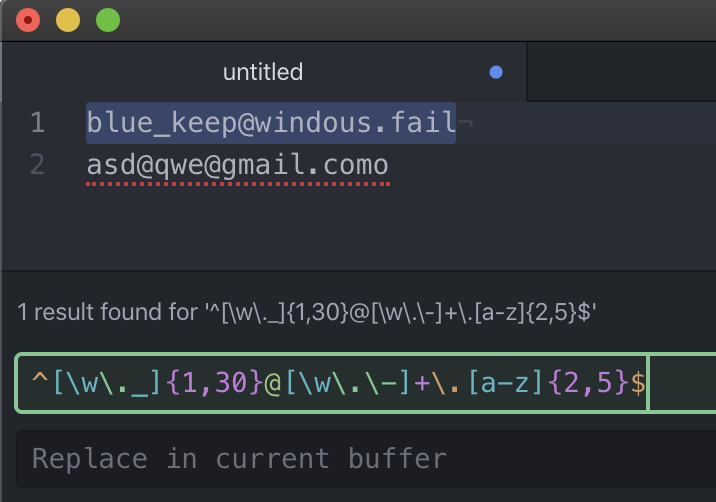

"Regular Expressions are the key tools that all Developer should have in their pocket", it's the phrase with the teacher [Alberto Alcocer](https://twitter.com/beco) repat constantly in the course of [regular expressions](https://platzi.com/clases/expresiones-regulares/) in Platzi.

A Regex (Regular Expression) is a patter to filter strings without using a lot of resources. Regexp are commonly used to filter URL, phone numbers, emails and so on. :+1:

#### Example 1:

If we would like to know if the next emails are valid for a registered in a specific platform.

```
blue_keep@windous.fail
asd@qwe@gmail.como
```

With the next Regex:

```
^[\w\._]{1,30}@[\w\.\-]+\.[a-z]{2,5}$
```

We would find that:



But what does it mean all those weird characters? :unamused: :expressionless:

The first thing that we have to know about Regexp is that each character or "Class" has a specific meaning. For example, the “.” class means whatever character.

#### Example 2:

`hola` - > r'`.`' - > [`h`,`o`,`l`,`a`]<br/>
**input** - > **Regex** - > **Result**

As we can see each letter making matched with the Regex.

The basics classes are in the next CheatSheets. We should have in mind all of it to read and create our Regex.

### Basics Class:

```
. -> whatever characters
\w - > represents all lowercase and uppercase words, digits and '_'
\d - > represents all digits
\s - > spaces in blank
```

Also we can create our classes using `[]`

### Costume Classes:

```
[0-9] ~ \d
[0-9a-zA-Z_] ~ \w
```

#### Example 3:

`hola` - > r'`[oa]`' - > [`o`,`a`]<br/>
**input** - > **Regex** - > **Result**

And we can repeat class using the counters. There are general counters and specific.

### General Counters:

```
* -> zero or more (greedy)
+ -> one or more
? -> zero or one
```

### Specific Counters:

```
{A,B}-> A to B elements
```

#### Example 4:

`hola=hi` - > r'`\w{2,3}`' - > [`hol`, `hi`]<br/>
**input** - > **Regex** - > **Result**

### Extras:

```
^ - > begging of the line
$ -> end of the line
[^] -> reverse of the class
```
