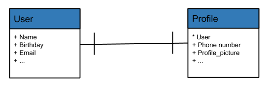
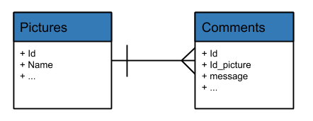
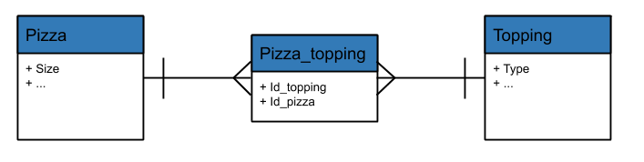

This post's to remain me what are the different types of models that I can use in a Django app.

## Models

Django uses an ORM "Object-related Mapping" to interact with the database. That means a Python Class "model" represent a table of the database. But these models could have extra functionalities.

Example:

Model :

```python

from django.db import models

class Person(models.Model):
    name = models.CharField()
    birthday = models.DateField()

```

Table:

<table>
  <thead>
    <tr>
      <th colspan={2} class="text-center">
        Person
      </th>
    </tr>
  </thead>
  <tbody>
    <tr>
      <td>
        <strong>name</strong>
      </td>
      <td>
        <strong>birthday</strong>
      </td>
    </tr>
    <tr>
      <td>Emily Glass</td>
      <td>25/09/1986</td>
    </tr>
    <tr>
      <td>Tom Example</td>
      <td>30/01/1991</td>
    </tr>
  </tbody>
</table>

## Model inheritance

There are 3 types of model inheritances:

- Proxy Models
- Multi-tale Models
- Abstrac Models

### Proxy Models

Proxy models are Python class that inherits from a model to add extra functionality without creating a new table in the database.\[1\]

Example:

```python
from django.db import models

class Person(models.Model):
    first_name = models.CharField()
    last_name = models.CharField()

class MyPerson(Person):
    class Meta:
        proxy = True

    def say_something(self, msg):
        print(msg)

```

### Multi-table Models

Multi-table model inheritance is created by class inherits from an
existing model. Django translate this in a new table with a
[One To One](#one_to_one) relation with the father model.

```python
from django.db import models

class Place(models.Model):
    name = models.CharField()
    address = models.CharField()

class Restaurant(Place):
    menu = models.CharField()
```

### Abstrac models

Abstract models are base models use to create model more complex. Abstracts models do not represent a table in the database. To create an abstract model we need to specify the Meta class inside the class model.

Example:

```python
from django.db import models

class Person(models.Model):
    """Abstract Class"""

    first_name = models.CharField()
    last_name = models.CharField()
    ...

    class Meta:
        """ Meta Options """
        abstract = True


class Student(Person):
    school_name = models.CharField()
    ...

```

In this case the student table looks like:

<table>
  <thead>
    <tr>
      <th colspan={3} class="text-center">
        Student
      </th>
    </tr>
  </thead>
  <tbody>
    <tr>
      <td>
        <strong>name</strong>
      </td>
      <td>
        <strong>birthday</strong>
      </td>
      <td>
        <strong>school_name</strong>
      </td>
    </tr>
    <tr>
      <td>Emily Glass</td>
      <td>25/09/1986</td>
      <td>MIT</td>
    </tr>
    <tr>
      <td>Tom Example</td>
      <td>30/01/1991</td>
      <td>Harvard</td>
    </tr>
  </tbody>
</table>

## relationships

<h3 id="one_to_one">One To One</h3>

One to one relationship is a "1:1" connection between tables.

{:refdef: style="text-align: center;"}

{: refdef}

```python
from django.db import models

class User(models.Model):
    """User Model"""

    name = models.CharField()
    birthday = models.CharField()
    email = models.CharField()
    ...


class Profile(models.Model):
    """Profile Model"""

    user = models.OneToOneField(User, on_delete=models.CASCADE)
    picture = models.ImageField(upload_to='users/pictures', blank=True, null=True)
    phone_number = models.CharField()
    ...

```

### One to Many

One to many relationships is a 1:N table relation.

Example:

{:refdef: style="text-align: center;"}

{: refdef}

```python
from django.db import models

class Picture(models.Model):
    """Picture Model"""

    name = models.CharField()
    ...


class Comments(models.Model):
    """Comments Model"""

    id_picture = models.ForeignKey(Picture, on_delete=models.CASCADE)
    message = models.CharField(max_length=255)
    ...

```

### Many to Many

Many to many relationship is a N:N table relations.

Example:

{:refdef: style="text-align: center;"}

{: refdef}

```python
from django.db import models

class Pizza(models.Model):
    """Pizza Model"""

    size = models.CharField()
    ...

class Topping(models.Model):
    """Topping Model"""

    pizza_topping = models.ManyToMany(Pizza, on_delete=models.CASCADE)
    type = models.CharField(max_length=255)
    ...

```

### References

1. [Django Model Documentation](https://docs.djangoproject.com/en/3.1/topics/db/models/)
