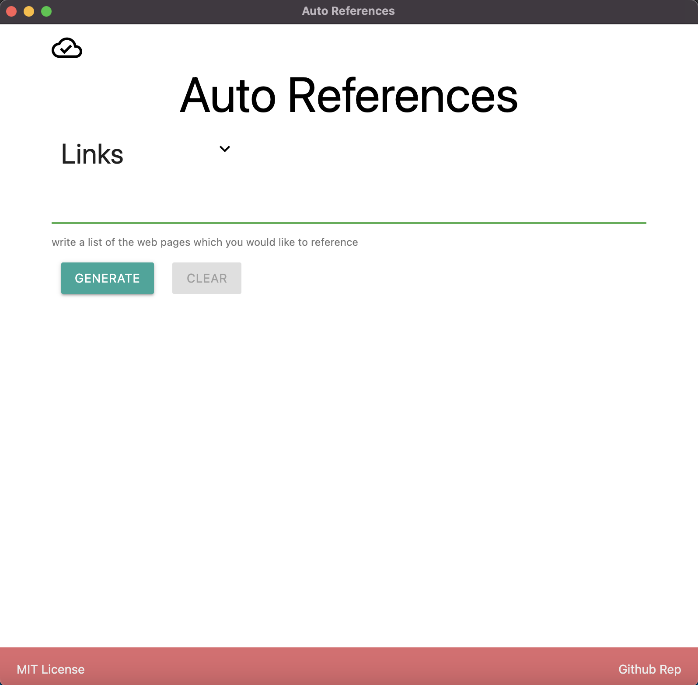
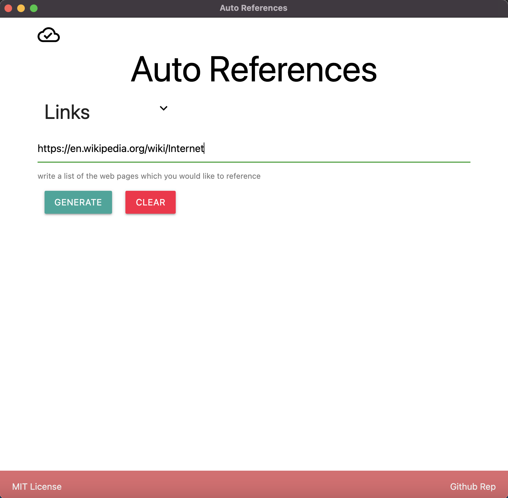
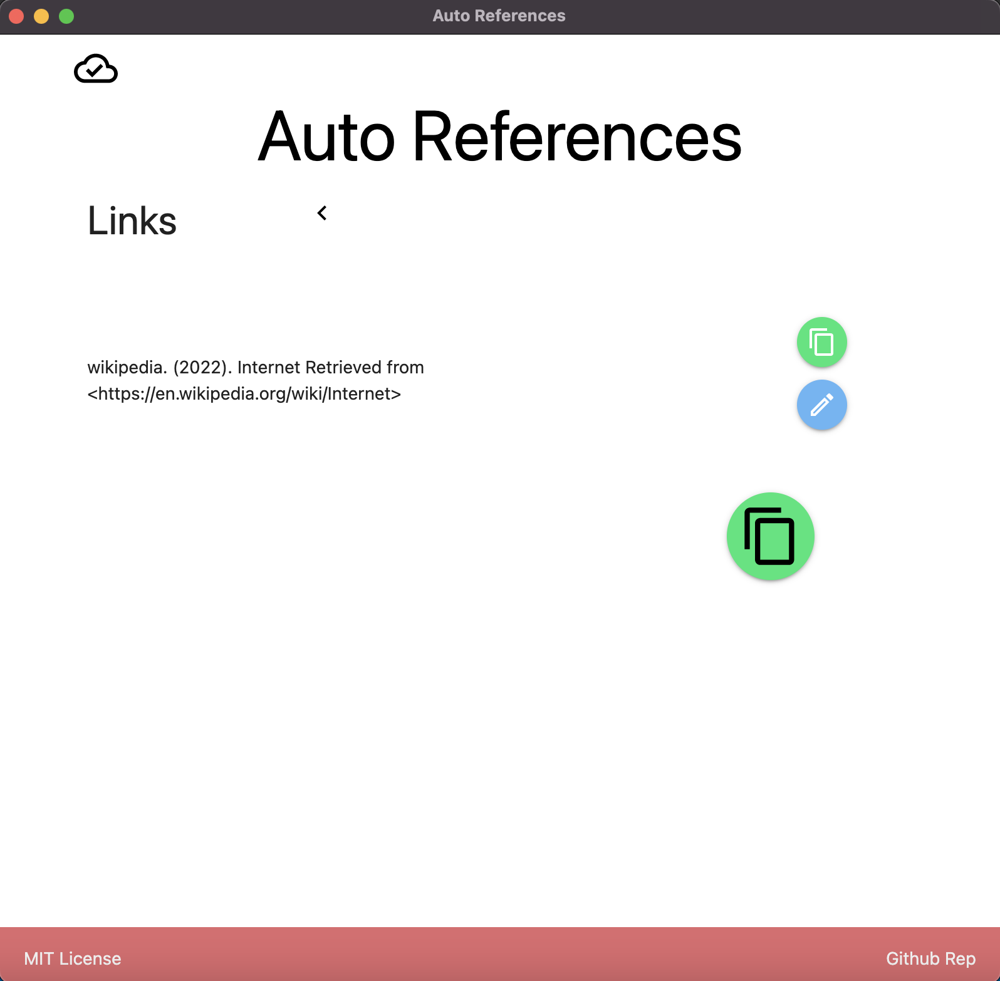

This is an Desktop APP which helps to create reference of Web Pages on APA format. This APP is build on Electron JS and React JS. Also, it's fully written on TypeScript.

App Stack:

- React JS
- Electron JS
- Jest
- TypeScript

## Usability

The interface is very simple, a textarea for de links and two buttons "generate" and "clear".



The first step is paste it all the links box



Then, the generate the references:



The app will scraping the necessary to generate reference from the more common web pages:

- Wikipedia
- Youtube
- StackOverflow

Use the "Copy" button to copy clipboard the references.

## Installation process

To use the application locally you should follow the next steps:

```bash
git clone git@github.com:jadry92/Auto-references.git
npm install .
npm run start
```

## Testing

If you are improving the application you can run the unit test using the command:

```bash
npm run test
```
