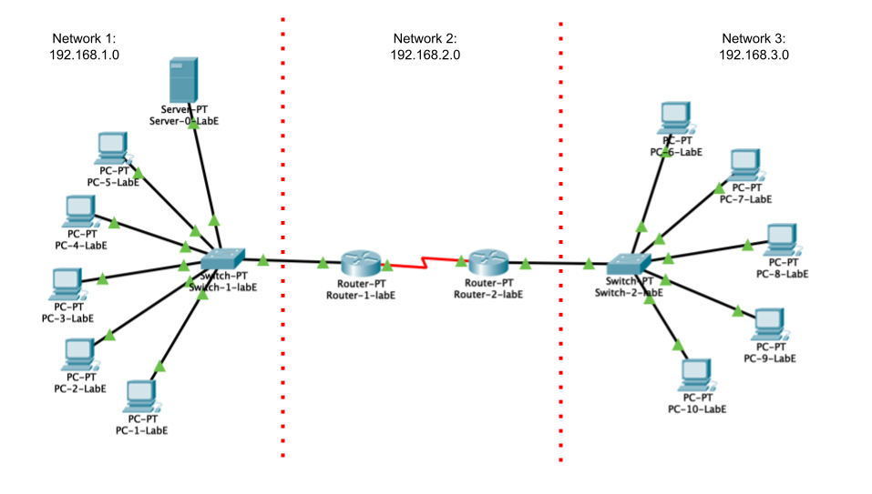

A new IT laboratory (Lab E) because of the growth of the student in this
field. Their idea is a laboratory with the following specification:

. 10 Desktop terminals.
. 1 Local Server.
. 2 switches.
. 2 routers.

The distribution of the desktop terminals will be equialy.
Half (5) will be connected to one switch and one router and the
other half (5) will be connected to other switch and the other
router and the server, as is shown in next image.

Based on that a class C network will be enough for all the lab and
using sub-netting will give an efficient use of the network.

For Network 1 the IP address:

$$
a^2 + b^2 = c^2
$$
